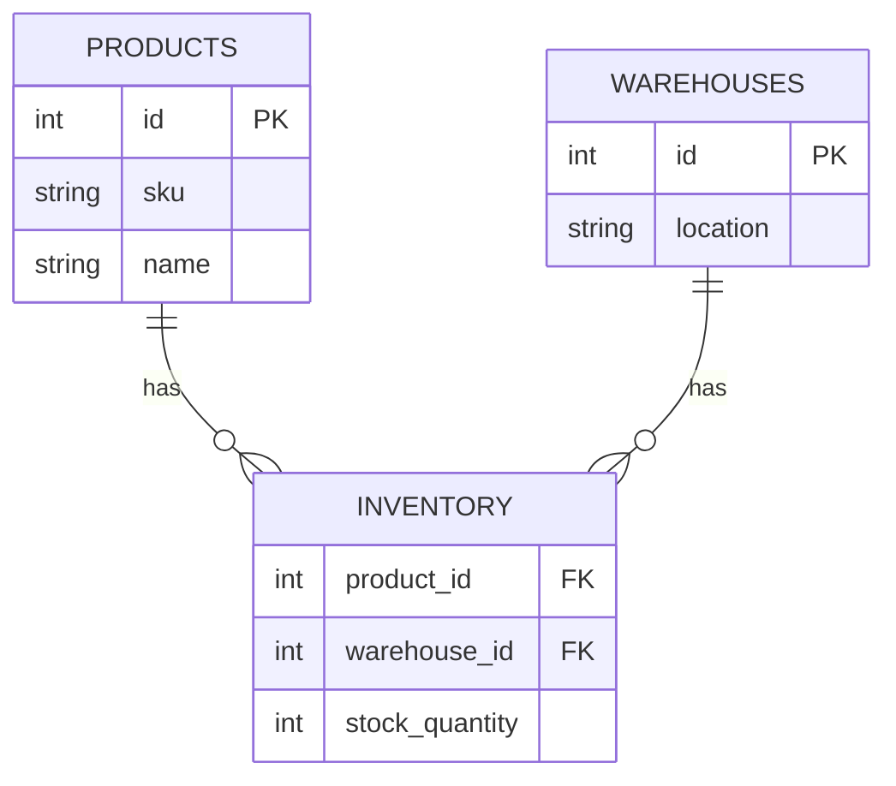

---

# Distributed Inventory Management System

A real-time, multi-warehouse inventory tracking system with conflict resolution, powered by Python, FastAPI, Kafka, and PostgreSQL.

## Features
- Multi-location sync: Real-time stock updates across warehouses
- Conflict resolution: Handles concurrent inventory modifications
- Redis caching: Optimizes high-frequency stock checks
- Kafka events: Decouples warehouse synchronization
- Predictive restocking: Basic ML-based replenishment alerts
- Dashboard: Real-time monitoring (optional React frontend)

---

## Tech Stack

| Component  | Technology            |
| ---------- | --------------------- |
| API        | FastAPI               |
| Database   | PostgreSQL            |
| ORM        | SQLAlchemy            |
| Caching    | Redis                 |
| Messaging  | Apache Kafka          |
| Analytics  | Pandas + Scikit-learn |
| Deployment | Docker                |

---

## Requirements

### 1. `requirements.txt`

```text
fastapi==0.95.2
uvicorn==0.22.0
sqlalchemy==2.0.15
psycopg2-binary==2.9.6
redis==4.5.5
confluent-kafka==2.1.1
pandas==2.0.1
scikit-learn==1.2.2
python-multipart==0.0.6
```

### 2. System Requirements

- Docker + Docker Compose
- Python 3.9+

---

## Quick Start

### 1. Clone and setup

```bash
git clone
cd inventory-system
```

### 2. Start services

```bash
docker-compose up -d
```

### 3. Install Python dependencies

```bash
pip install -r requirements.txt
```

### 4. Run the FastAPI server

```bash
uvicorn app.main:app --reload
```

Access the API at: http://localhost:8000

---

## API Endpoints

| Endpoint                  | Method | Description                           |
| ------------------------- | ------ | ------------------------------------- |
| `/inventory/update`       | POST   | Adjust stock levels                   |
| `/inventory/{product_id}` | GET    | Check current stock across warehouses |
| `/warehouses`             | GET    | List all warehouses                   |

Example Request:

```bash
curl -X POST "http://localhost:8000/inventory/update" \
-H "Content-Type: application/json" \
-d '{"product_id": 1, "warehouse_id": 1, "quantity_change": -5}'
```

---

## Database Schema



---

## Development

### Running Tests

```bash
pytest tests/
```

### Access Services

| Service      | URL                   |
| ------------ | --------------------- |
| FastAPI      | http://localhost:8000 |
| PGAdmin      | http://localhost:5050 |
| RedisInsight | http://localhost:8001 |

---

## Future Improvements

- Add React dashboard
- Enhanced ML-based predictions
- Supplier API integrations (e.g., Shopify, SAP)

---
